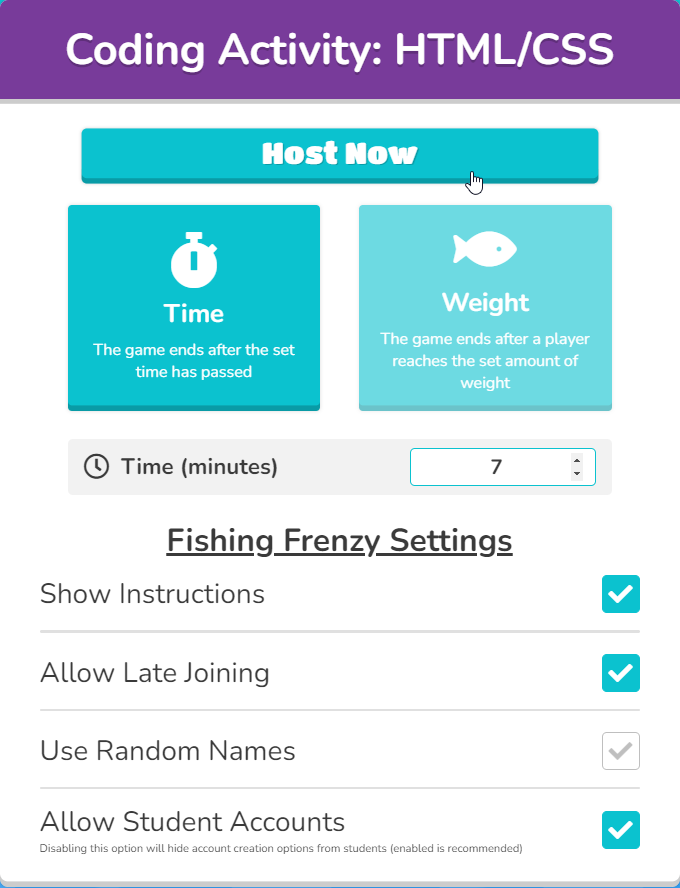

# Blooket Setup
[Blooket](https://www.blooket.com/) is a fun formative assessment tool that's similar to Kahoot, but more game-based. There are a variety of game modes where the students compete against each other in different ways. Answering questions correctly helps them achieve more success in each game.

An account is required to host the game; here are some credentials you can use:

- Username: **techoutinst**
- Password: **Tech0utreach**

When setting up the game, try to time it so that it ends just a couple minutes before the overall session ends. Note that it will likely take 2-3 minutes for all the students to join the game, so a game time limit of **7 minutes** might end up taking about **10 minutes**. In general, **7 minutes** is a pretty good amount of time. For a 90 minute lesson plan, **10** or **12** minutes may be a good time limit - it depends on when the Blooket begins.

1. Go to the [Blooket Login Page](https://id.blooket.com/login)
1. Enter the credentials above
1. Once logged into Blooket, go to the [question set](https://dashboard.blooket.com/set/6426f2b7270eb96cab922257)
1. Click the **Host** button  
    
1. Select the **Fishing Frenzy** game mode, and click the **Host Game** button  
    
1. Adjust the time as needed, and click the **Host Now** button  
    
1. Instruct students to go to **play.blooket.com**, enter the Game ID and a nickname, and join the game
1. Once all students have joined, click the **Start** button  
    

From there, the students will work on their own, answering questions and trying to get the most fish!
