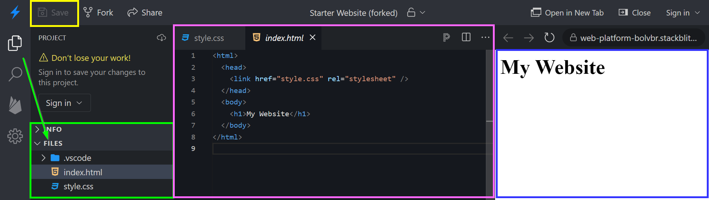
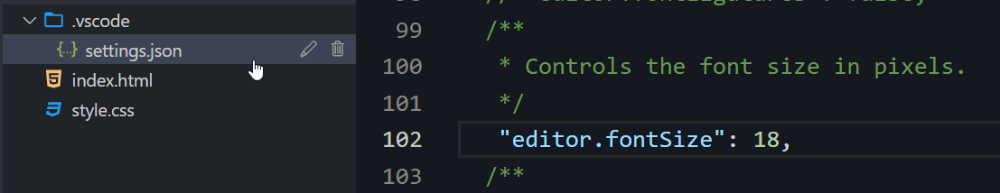
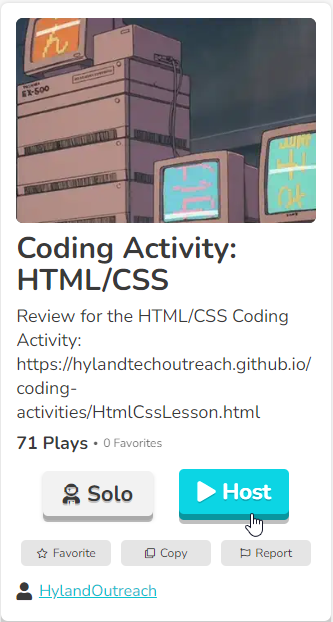
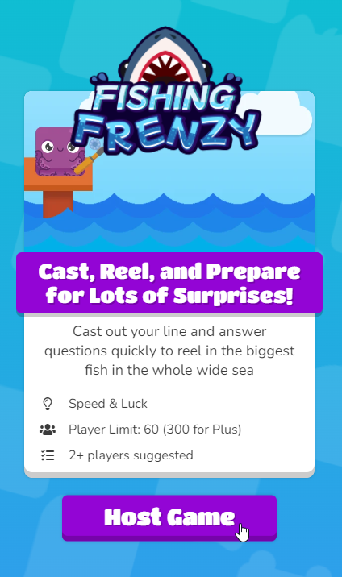
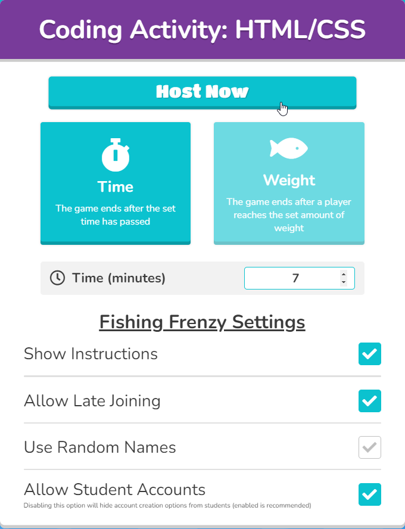
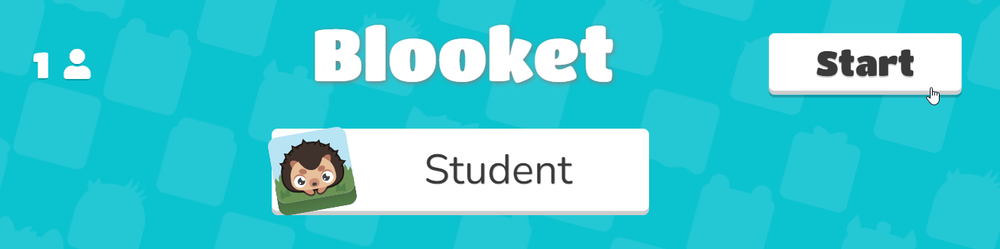

# Lesson Plan: Building a Website
This hour-long activity is designed to introduce students to the world of web development. The goal is for them to have fun building websites with some basic HTML and CSS. They do not need to fully grasp the concepts; it's more about providing an engaging, memorable experience, and showing them a bit of what they can do with this technology.

### Agenda
Here is a rough outline of the activity as a whole:

| Item | Time |
|-|-|
| Introduction | 10m |
| Code-Along | 30m |
| Additional Topics | 5m |
| Formative Assessment | 10m |
| Conclusion | 5m |

### Tips
Here are some tips to ensure a successful run:

- Before the activity, **read through this lesson plan thoroughly**
- During the activity, ask the students questions as often as possible
    - Ask for their names, hobbies, movies they've seen, colors to use, fonts... anything!
    - Ask for suggestions about what to type next
    - Poll them to see what they know, or what they'd like to do
- Encourage students to make their own choices in the code
    - The more they personalize their websites, the more fun they tend to have!
- Take it slow at first, and always check to see how the students are progressing
    - Don't trust them to tell you; make sure to actually have an assistant look at their screens and give the go-ahead
    - Give students time to catch up before moving too far ahead, but...
    - Don't stall too long on any one part

### Recording
Take a look at a [live recording of the activity](https://app.sharebase.com/#/document/11292065/share/3-GVGTlJyQqCA6B8UG6il30xquJuw) for some insight into how it could go. This is just one example of how to facilitate everything - feel free to put your personal spin on it as an instructor.

>_Note: The recording does not include the setup or conclusion, and the slides have changed a bit_

## Introduction: Slides & Demo
To kick things off, present the [Google Slides presentation](https://docs.google.com/presentation/d/1d4Fohg1qiYV1CmymTQCuwFcLzDlDUGURlk7KO7TWwlo/edit?usp=sharing).

### Process
Before presenting, be sure to read through the notes in the slides. The notes on the first slide include Activity Preparation instructions. A few of the slides have animations, so be aware of those. Note that the content has changed slightly since the live recording.

It may be helpful to have the notes up during the presentation. To do this, use **Presenter view** like this:

There is one slide that involves a demo - for this slide, follow the instructions to open any page on Wikipedia and view the page source. Ask the students for a movie, or TV show, or anything else.

In general, the presentation should be as interactive as possible, and you should ask questions as often as you can.

### The Last Slide: Lead Into The Code-Along
The instructions on the last slide show students how to prepare for the code-along. Log-in credentials will be different for each room, so be sure to write the username and password on the whiteboard.

Once students have logged into their computers, they should open Google Chrome, type the URL into the URL bar, and hit **Enter**. This will take them to a [StackBlitz project with some starter code](https://stackblitz.com/edit/web-platform-2wdyzk?file=index.html). From there, clicking the **Fork** button will create a new version of the project for them to customize!

## Code-Along: Building a Website
The [code-along](HtmlCssLesson.md) is the heart of the activity. This is where they actually get to start building a website of their very own.

### Background: StackBlitz
[StackBlitz](https://stackblitz.com/) is a pretty neat platform that lets developers write and run web code quite quickly. It looks like this:

- **Files Area**: On the left, this is where you can select which file to edit
- **Code Editor**: In the middle, this is where you can actually edit the code for the project
- **Web View**: On the right, this is where you can see the website you're building
- **Save Button**: In the upper left, this button saves the project, and should automatically refresh the web view

It may be desireable to make the editor font a little bigger. This is possible by updating the `editor.fontSize` property in the **.vscode/settings.json** file. Open the **settings.json** file, press **Ctrl**+**f** to search for the `editor.fontSize` property, remove the `//` in front of the line to uncomment it, and change the `12` to something like `18`:

Either way, it will likely be a good idea to **🔍 zoom in 🔎** so that all students can clearly see the code. It is also good to aware that the bottom of the screen may be hard to see from certain seats, so try to keep important things on the top half.

#### ⚠ NOTICE ⚠
One downside to StackBlitz is that it can be a little glitchy - it may be necessary for students to save their project multiple times before the web view refreshes. There is also no easy way for them to publish their finished websites - they can do this if they have a GitHub account, but there is no way to do it out-of-the-box.

### Process
Follow the instructions to facilitate the activity. Tell the students to follow along by typing what you type - but they are welcome to change the content. There will also be several points where you can challenge the students; in fact, the first code change is meant to be a not-so-challenging challenge for them!

There is also some explanatory text in the instructions - feel free to skip past that, or review it as desired. Some of it should have been covered in the introduction.

## Additional Topics
If there is any time remaining between the code-along and the formative assessment, feel free to walk through some of the [additional topics](HtmlCssAdditionalTopics.md).

Students may express interest in one of the topics over another, but typically YouTube videos are a good bet. From there, it is up to the whim of the students and the discretion of the instructor.

## Formative Assessment: Blooket
[Blooket](https://www.blooket.com/) is a fun formative assessment tool that's similar to Kahoot, but more game-based. There are a variety of game modes where the students compete against each other in different ways. Answering questions correctly helps them achieve more success in each game.

An account is required to host the game; here are some credentials you can use:

- Username: **techoutinst**
- Password: **Tech0utreach**

When setting up the game, try to time it so that it ends just a couple minutes before the overall session ends. Note that it will likely take 2-3 minutes for all the students to join the game, so a game time limit of **7 minutes** might end up taking about **10 minutes**. In general, **7 minutes** is a pretty good amount of time.

1. Go to the [Blooket Login Page](https://id.blooket.com/login)
1. Enter the credentials above
1. Once logged into Blooket, go to the [question set](https://dashboard.blooket.com/set/6426f2b7270eb96cab922257)
1. Click the **Host** button  
    
1. Select the **Fishing Frenzy** game mode, and click the **Host Game** button  
    
1. Adjust the time as needed, and click the **Host Now** button  
    
1. Instruct students to go to **play.blooket.com**, enter the Game ID and a nickname, and join the game
1. Once all students have joined, click the **Start** button  
    

From there, the students will work on their own, answering questions and trying to get the most fish!

## Conclusion
Hopefully there will be a minute at the end for a brief wrap-up. Some key things:

- Thank the students for participating
- Encourage them to continue learning about coding on their own
- Tell them they can reach us at **techoutreach@hyland.com** if they have any questions or would like any guidance
- Send them on their way!
