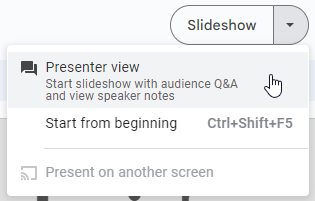

# Lesson Plan: Building a Website
This hour-long activity is designed to introduce students to the world of web development. The goal is for them to have fun building websites with some basic HTML and CSS. They do not need to fully grasp the concepts; it's more about providing an engaging, memorable experience, and showing them a bit of what they can do with this technology.

### Tips
Here are some tips to ensure a successful run:

- Before the activity, **read through this lesson plan thoroughly**
- During the activity, ask the students questions as often as possible
    - Ask for their names, hobbies, movies they've seen, colors to use, fonts... anything!
    - Ask for suggestions about what to type next
    - Poll them to see what they know, or what they'd like to do
- Encourage students to make their own choices in the code
    - The more they personalize their websites, the more fun they tend to have!
- Take it slow at first, and always check to see how the students are progressing
    - Don't trust them to tell you; make sure to actually have someone look at their screens and give the go-ahead
    - Give students time to catch up before moving too far ahead, but...
    - Don't stall too long on any one part

### Recording
Take a look at a [live recording of the activity](https://app.sharebase.com/#/document/11292065/share/3-GVGTlJyQqCA6B8UG6il30xquJuw) for some insight into how it could go. This is just one example of how to facilitate everything - feel free to put your personal spin on it as an instructor.

>_Note: The recording does not include the setup or conclusion_

## Introduction: Slides & Demo
To kick things off, present the [Google Slides presentation](https://docs.google.com/presentation/d/1d4Fohg1qiYV1CmymTQCuwFcLzDlDUGURlk7KO7TWwlo/edit?usp=sharing).

### Process
Before presenting, be sure to read through the notes in the slides. The notes on the first slide include Activity Preparation instructions. A few of the slides have animations, so be aware of those. Note that the content has changed slightly since the live recording.

It may be helpful to have the notes up during the presentation. To do this, use **Presenter view** like this:

There is one slide that involves a demo - for this slide, follow the instructions to open any page on Wikipedia and view the page source. Ask the students for a movie, or TV show, or anything else.

In general, the presentation should be as interactive as possible, and you should try to ask questions as often as you can.

### The Last Slide: Lead Into The Code-Along
The instructions on the last slide show students how to prepare for the code-along. Log-in credentials will be different for each room, so be sure to write the username and password on the whiteboard.

Once students have logged into their computers, they should open Google Chrome, type the URL into the URL bar, and hit **Enter**. This will take them to a [StackBlitz project with some starter code](https://stackblitz.com/edit/web-platform-2wdyzk?file=index.html). From there, clicking the **Fork** button will create a new version of the project for them to customize!

## Code-Along: Building a Website
The [code-along](HtmlCssLesson.md) is the heart of the activity. This is where they actually get to start building a website of their very own.

### Background: StackBlitz
[StackBlitz](https://stackblitz.com/) is a pretty neat platform that lets developers write and run web code quite quickly.

TODO: Explain environment, font size

One downside is that it can be a little glitchy - it may be necessary for students to save their project multiple times before the web preview refreshes. There is also no easy way for them to publish their finished websites - they can do this if they have a GitHub account, but there is no way to do it out-of-the-box.

### Process
Follow the instructions to facilitate the activity. Tell the students to follow along by typing what you type - but they are welcome to change the content. There will also be several points where you can challenge the students; in fact, the first code change is meant to be a not-so-challenging challenge for them!

## Additional Topics

## Formative Assessment: Blooket

## Conclusion

## Agenda

| Activity | Time |
|-|-|
| Introduction | 10m |
| Code-Along | 30m |
| Additional Topics | 5m |
| Formative Assessment | 10m |
| Conclusion 5m |