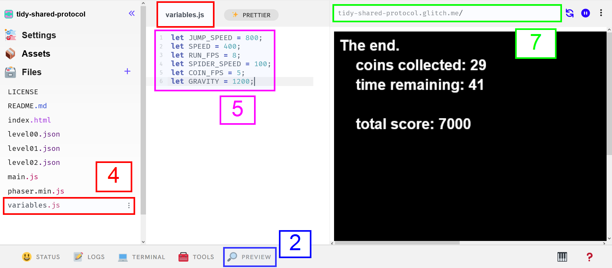

# Hack the Platformer
Follow these steps to play the game, hack the game, and try to beat the high score!

1. Create a new game by going to **[tinyurl.com/hack-remix](https://tinyurl.com/hack-remix/)**
2. At the bottom of the screen, click the PREVIEW button  
3. Play the game
4. On the left, click the **variables.js** file to open it
5. Update the numbers to change the behavior of the game
6. Play your new version of the game
7. Copy the URL above the preview to share your game

Here's where everything is in Glitch:

