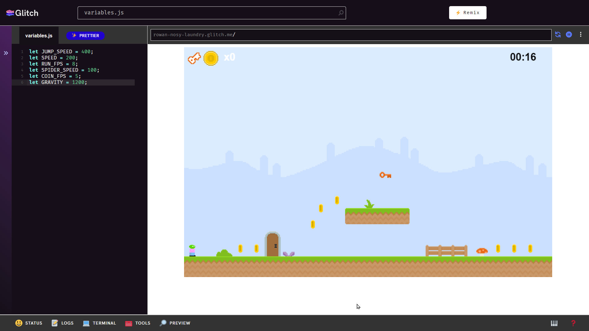

# Hack the Platformer: Activity Guide
First, ensure that the workstation has been reset based on the [setup instructions](FacilitatorSetup.md). There should be a new, fresh copy of the game to edit, and the screen should look something like this:

As a participant approaches, start by talking to them using the [Facilitator Guide](FacilitatorGuideSheet.docx) document. If they want to interact with the game, follow these steps:

1. Show the participant how to play the game  
    - Arrow keys move, try to collect coins, keys open doors
1. Let the participant play the game, and tell them to try to beat the high score  
    - If they place on the leaderboard, add their name and score
1. After they beat the game, show the participant the **variables.js** file
1. Explain that the _variables_ control the gameplay  
    - In computer science, variables are containers for data
1. Let the participant change around some variables, and replay the game
1. See if they can beat their former score with new variable settings
1. When they are done, tell them they can play their game at the auto-generated URL  
    - e.g., `rowan-nosy-laundry.glitch.me`

A guide that is designed to be student-facing is available [here](StudentDesc.md).