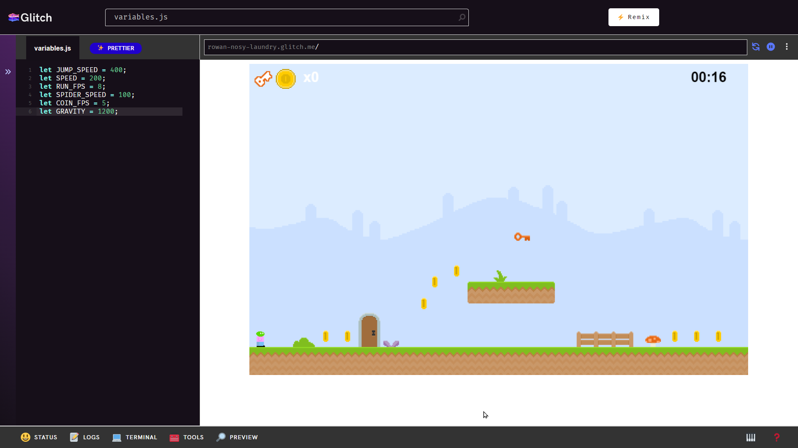

# Hack the Platformer: Setup
Before the event begins, set things up so that the participants who come to the table will have access to the keyboard, mouse, and monitor. The screen can be duplicated on the laptop, and the facilitator should be able to control anything as needed. In between participants, the workstation should be reset so it's ready for the next round.

1. Create a new copy of the project at [**tinyurl.com/hack-remix**](https://tinyurl.com/hack-remix)
1. Click the **🔎 PREVIEW** button from the bottom menu, and select **"☝ Open preview pane"**
1. Open the **variables.js** file from the Files pane on the left
1. Drag the preview pane to make it bigger
1. Go full screen
1. Zoom in as much as possible

The window on the monitor should look something like this:

