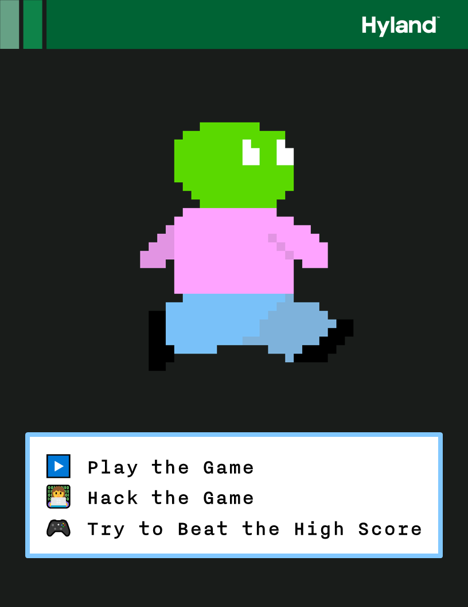

# Hack the Platformer: Resource Catalog
Here is a list of everything to bring to the event:

- Laptops (2)  
    - Must be Wi-Fi enabled
    - Must have Google Chrome
- Monitors (2)
- Docks (2)
- Charging Cables (2)
- Mice (2)
- Keyboards (2)
- Surge Protector
- Giveaway Items
- Tech Outreach Flyers
- Tech Outreach Business Cards
- Candy Bag
- Participant Instruction Sheets* (2)
- Facilitator Guide Sheets^ (2)
- Name Badges
- Sharpies
- Portable Whiteboard†
- Expo Markers / Erasers
- Tablecloth

## *Participant Instruction Sheets
There is a page to be printed out to attract participants to the table, and briefly outline the activity instructions:

### Note
The image for the page was created with the [ParticipantInstructions.pptx](ParticipantInstructions.pptx) PowerPoint. Exporting it as an image ensures it appears as intended when printed. This page should be printed and displayed at the table for the participants to see.

## ^Facilitator Guide Sheets
There is a [Facilitator Guide document](FacilitatorGuideSheet.docx) designed to help facilitators while they're at the table. There are some introductory questions at the top to ask participants when they approach, as well as some quick blurbs about Hyland and computer science. There is also a simplified guide to facilitate the activity.

This page should be printed for facilitators to use as a reference.

## †Portable Whiteboard
The whiteboard can be used to keep track of the high score (or top three scores) throughout the event. If a participant places on the leaderboard, it should be documented. They can receive candy and/or a giveaway item based on the discretion of the facilitator.
