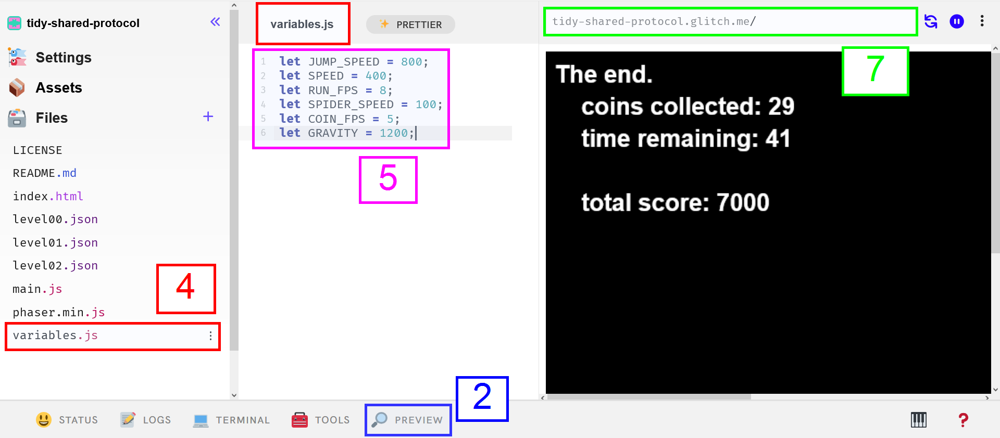

# Hack the Platformer
Follow these steps to play the game, hack the game, and try to beat the high score!

1. Create a new game by going to **[glitch.com/edit/#!/remix/platformer-hacker](https://glitch.com/edit/#!/remix/platformer-hacker)**
2. At the bottom of the screen, click the PREVIEW button, and select "Open preview pane"  
3. Play the game
4. On the left, click the **variables.js** file to open it
5. Update the numbers to change the behavior of the game
6. Play your new version of the game
7. Copy the URL _above the preview_ to share your game

Here's where everything is in Glitch:

