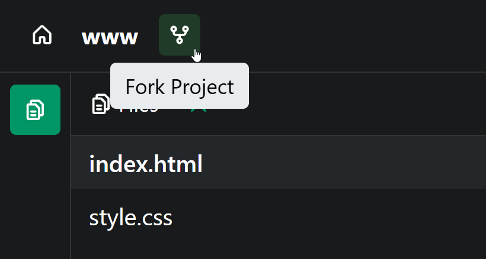
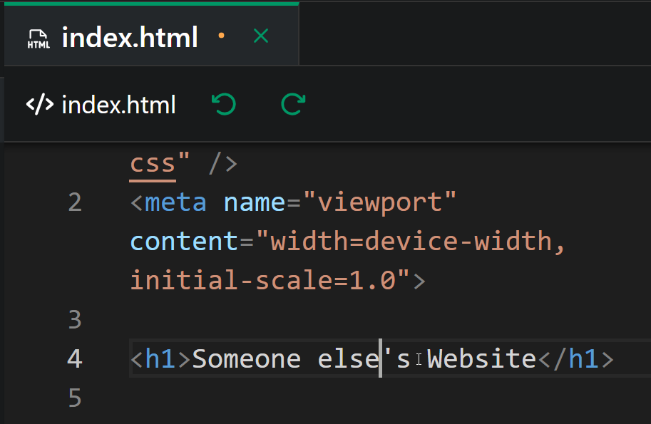
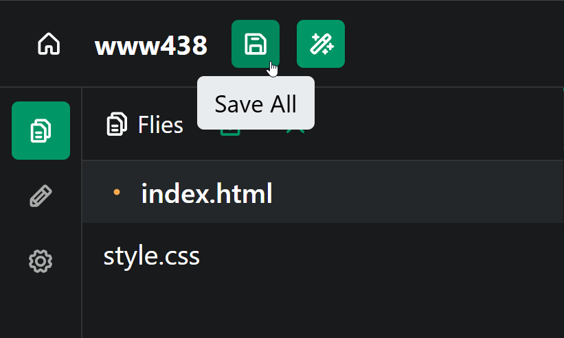
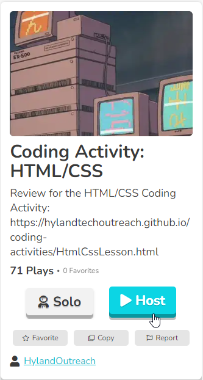
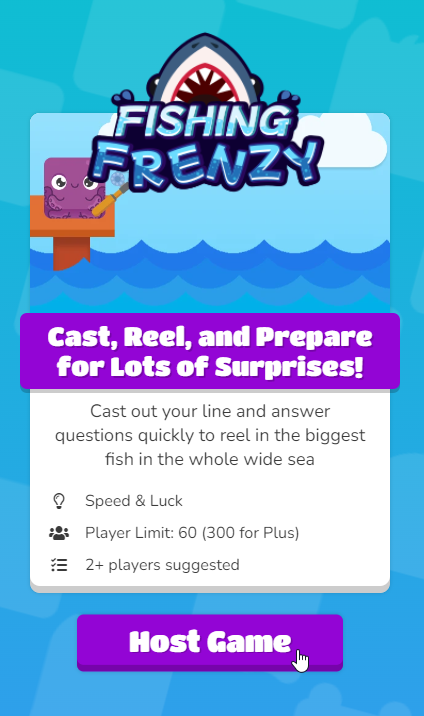
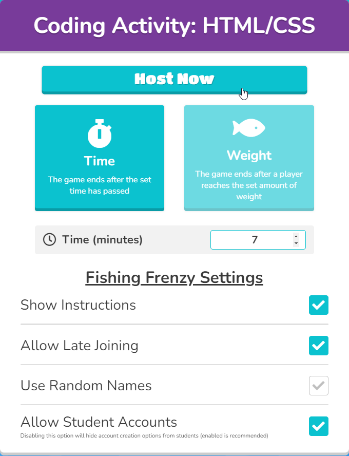
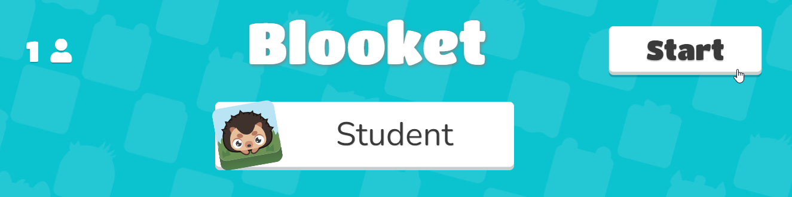

# General Coding Activity Tips
Here are some tips to ensure a successful run:

- Before the activity, **read through the lesson plan thoroughly**
- During the activity, ask the students questions as often as possible
  - Ask for their names, hobbies, movies they've seen, colors to use, fonts... anything!
  - Ask for suggestions about what to type next
  - Poll them to see what they know, or what they'd like to do
- Encourage students to make their own choices in the code
  - The more they personalize their projects, the more fun they tend to have!
- Take it slow at first, and always check to see how the students are progressing
  - Don't trust them to tell you; make sure to actually have an assistant look at their screens and give the go-ahead
  - Give students time to catch up before moving too far ahead, but...
  - Don't stall too long on any one part

## Code-Along Process
Follow the instructions (e.g., the [building websites](BuildingWebsites/CodeAlong.md) activity) and lead the students to do the same.

Tell the students to follow along by typing what you type - but they are welcome to change the content. There will also be several points where you can challenge the students; in fact, the first code change is meant to be a not-so-challenging challenge for them!

There is also some explanatory text in the instructions - feel free to skip past that, or review it as desired. Some of it should have been covered in the introduction.

## HyTOP
[HyTOP](https://hytop.onrender.com) (the **Hy**land **T**ech **O**utreach **P**ortal) is a place for students to build and host websites online. Projects (like [this starter](https://hytop.onrender.com/e/www)) can be forked:  

  

...edited:  

  

...saved:  

  

...and shared:  

  

## Blooket
[Blooket](https://www.blooket.com/) is a fun formative assessment tool that's similar to Kahoot, but more game-based. There are a variety of game modes where the students compete against each other in different ways. Answering questions correctly helps them achieve more success in each game.

An account is required to host the game; here are some credentials you can use:

- Username: **techoutinst**
- Password: **Tech0utreach**

When setting up the game, try to time it so that it ends just a couple minutes before the overall session ends. Note that it will likely take 2-3 minutes for all the students to join the game, so a game time limit of **7 minutes** might end up taking about **10 minutes**. In general, **7 minutes** is a pretty good amount of time.

Generally, here are the steps to host a Blooket quiz:

1. Go to the [Blooket Login Page](https://id.blooket.com/login)
1. Enter the credentials above
1. Once logged into Blooket, go to the given question set link
1. Click the **Host** button  
    
1. Select the **Fishing Frenzy** game mode, and click the **Host Game** button  
    
1. Adjust the time as needed, and click the **Host Now** button  
    
1. Instruct students to go to **play.blooket.com**, enter the Game ID and a nickname, and join the game
1. Once all students have joined, click the **Start** button  
    
