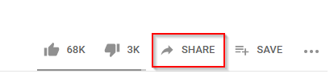
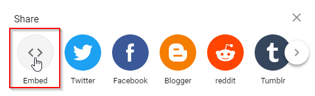
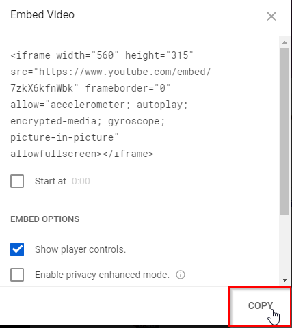
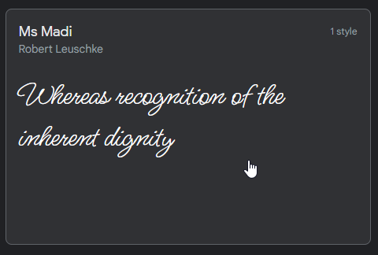
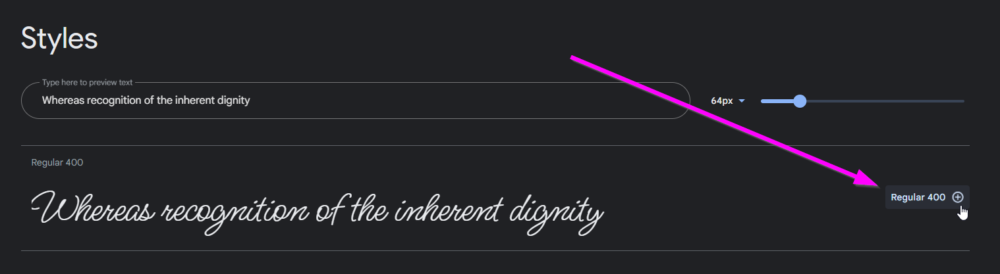
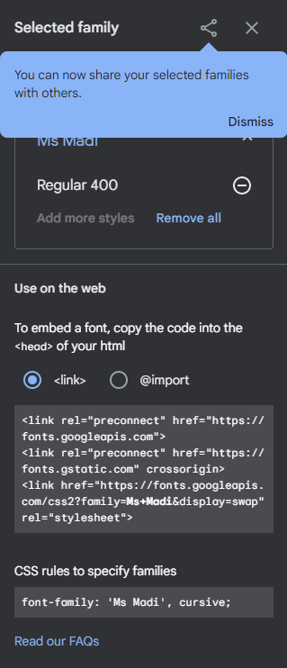
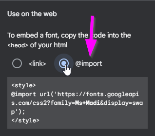
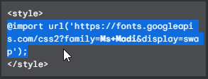
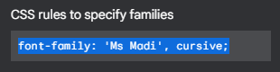
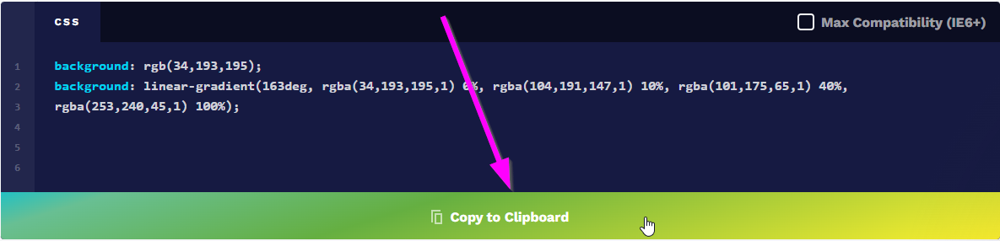

# Building a Website: Additional Topics
With any remaining time, make updates to the webpage by following these instructions!

## HTML: Embed a YouTube Video
It is pretty simple to add a YouTube video to your website; YouTube does all the hard work for you!

1. Open a new tab and go to [YouTube](https://youtube.com)
1. Search for an appropriate video (e.g., [color red](https://www.youtube.com/watch?v=8YWl7tDGUPA))
1. Under the video, click the "SHARE" button  
     
1. Click "Embed"  
      
1. Click "COPY"  
    
1. Back in StackBlitz, in the **index.html** file, paste the code at the bottom of the HTML section
    - Use **Ctrl**+**v**
1. Watch the video on your website!

The code should look something like this:

```html
<iframe width="560" height="315" src="https://www.youtube.com/embed/7zkX6kfnWbk" frameborder="0" allow="accelerometer; autoplay; encrypted-media; gyroscope; picture-in-picture" allowfullscreen></iframe>
```

## CSS: Custom Fonts
There are _some_ fonts built into the web by default, but there are a ton more available online. Use [Google Fonts](https://fonts.google.com/) to outfit your website with a cool custom one!

### Part One: Importing the Font
The first step is to grab the code that will download the font for you.

1. Open a new tab and go to [fonts.google.com](https://fonts.google.com/)
1. Search through and find a nice font to use
    - For example, [Ms Madi](https://fonts.google.com/specimen/Ms+Madi)
1. Click on the desired font  
    
1. Scroll down on the page, and find the "Regular 400 ⊕" button  
    
1. The "Selected family" pane should appear on the right  
    
1. In that pane, under the "Use on the web" section, click the "@import" selector  
    
1. Highlight the code within the `<style></style>` tags (starting with `@import`) and copy it  
    
1. Go back to the StackBlitz project, and open the **style.css** file for editing
1. Make space at the very top, and paste the code (starting with `@import`)
    - This should be outside of any `{` and `}`

The code at the top should end up looking something like this:

```css
@import url('https://fonts.googleapis.com/css2?family=Ms+Madi&display=swap');
```

### Part Two: Using the Font
Now that the font has been imported, it will be possible to use it in the CSS!

1. Go back to [Google Fonts](https://fonts.google.com/)
1. Back in the "Selected family" pane, find the "CSS rules to specify families" section
1. In there, highlight and copy the code starting with `font-family:`  
    
1. Go back to the StackBlitz project, and open the **style.css** file for editing
1. Within the `body` rule, (between `{` and `}`), make a new line
1. There, paste the code (starting with `font-family`)

That should be it! Try running the project and viewing the page. The text should be styled with the new font!

The code should end up looking something like this:

```css
@import url('https://fonts.googleapis.com/css2?family=Ms+Madi&display=swap');

body {
  font-family: 'Ms Modi', cursive;
}
```

## CSS Challenge: Create a Gradient Background or a Background Image
Currently, the background of the website is just a solid color. But it can be a gradient color, or even an image!

### Background Gradient
Luckily, there is a website that generates CSS code for gradients.

1. Open a new tab and go to [cssgradient.io](https://cssgradient.io)
1. Play around with the color selection tools to find a nice gradient to use
    - Select different colors for each point on the line
    - Change angles or gradient type
    - Add new color points
    - Do whatever makes it look the best!
1. Once a good gradient is found, scroll down a bit to the **CSS** section
1. Click the "Copy to Clipboard" button at the bottom of the **CSS** box  
    
1. Go back to the StackBlitz project, and open the **style.css** file for editing
1. Within the `body` rule, (between `{` and `}`), paste the code (starting with `background`)
1. Save the project to see the background change!

That should be it! The code should end up looking something like this:

```css
body {
  background: rgb(34,193,195);
  background: linear-gradient(163deg, rgba(34,193,195,1) 0%, rgba(104,191,147,1) 10%, rgba(101,175,65,1) 40%, rgba(253,240,45,1) 100%);
}
```

### Background Image
It is also possible to give the page a background image. 

1. Find an image online
1. Copy the image address
1. Open the **style.css** file
1. Remove the value for the `background` property
1. Replace the value with `url("")`
1. Inside the quotes, paste the image address
1. Save the project to see the background change!

It should look something like this:

```css
body {
    background: url("https://cdn.wallpaperhub.app/cloudcache/6/9/0/e/e/f/690eefe3ba1f553e0ea527f51ee407b604b681b4.jpg");
}
```

## CSS: Header Text Shadow
Another neat CSS trick is to add text shadow. For this example, add text shadow _only_ to the `h1` header.

1. In the **style.css** file, make a new line at the very bottom under everything
1. Create a new rule for the top header by adding `h1` and `{`
    - This will mean that all styles apply to each `h1` HTML element
1. Make a new line, and press space a couple times
1. There, add a new property: `text-shadow: red -1px 1px`
1. Make another new line, and add the closing `}` curly bracket
1. Save the project to see the shadow!
1. Update the numbers and the color to see how it changes the effect

The code should look something like this:

```css
h1 {
    text-shadow: red -1px 1px;
}
```

## CSS: Change Text Color on Hover
To make the website feel a bit more **🌟 i n t e r a c t i v e 🌟**, update the styles when hovering over certain elements on the page!

1. In the **style.css** file, create a new rule for `li` at the bottom of the file
    - The styles in this rule will only affect `li` elements
1. Add the `color` property with a value of `orange`
    - Notice that the text color changed
1. Update the beginning part so that instead of `li`, it is `li:hover`
    - This means the styles will only apply when the user hovers over the `li` elements
1. Save the project, and hover over the list items to see them change!
1. Update the values to change the effect

```css
li:hover {
  color: orange;
}
```

## More Possibilities: JavaScript
HTML and CSS are cool, but you can do even more with your websites if you start to use JavaScript. Here are some cool things that JavaScript can do:

### Creative Coding with p5.js and OpenProcessing
[p5.js](https://p5.js) is a friendly tool for learning to code and make art. It is a free and open-source JavaScript library built by an inclusive, nurturing community. p5.js welcomes artists, designers, beginners, educators, and anyone else!

[Click here to check out some of the wild possibilities of p5.js on OpenProcessing.](https://openprocessing.org/discover/#/trending)

## 3D Worlds with A-Frame
It is surprisingly easy to start building a 3D world on the web. [A-Frame](https://aframe.io/) is a great tool for doing so, and you can create without ever leaving an **index.html** file.

They even have a starter project on Glitch - [click here for the introduction](https://aframe.io/docs/1.6.0/introduction/)!

## Games with Phaser
[Phaser](https://phaser.io/) is a game development framework that works with JavaScript.

[Click here to remix a platformer game on Glitch.](https://glitch.com/edit/#!/remix/platformer-hacker/)
