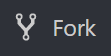
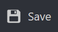
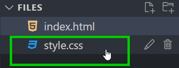
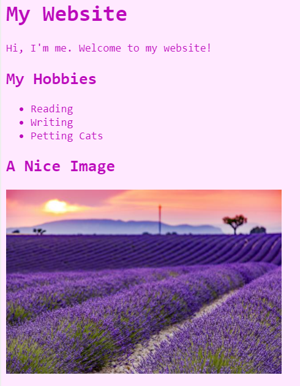

# Building a Website
In this activity, use HTML and CSS to create your own website!

## Introduction
A few different concepts will be used during this activity:

- [HTML](https://developer.mozilla.org/en-US/docs/Web/HTML) is a **language** that lets developers to create websites. A web browser takes the HTML code, and displays it as a nice-looking webpage. Every website has a _source_, which can be viewed by right clicking and selecting **View page source** in the menu!
- [CSS](https://developer.mozilla.org/en-US/docs/Glossary/CSS) is a **language** that lets developers add style to websites. This includes things like fonts, colors, and more.
- [StackBlitz](https://stackblitz.com/) is a **website** that lets developers create websites.

_[Click here to view the Google Slides presentation that covers these concepts in more detail.](https://docs.google.com/presentation/d/1d4Fohg1qiYV1CmymTQCuwFcLzDlDUGURlk7KO7TWwlo/edit?usp=sharing)_

## Setup
To get started, follow the steps below.

1. Open up Google Chrome
1. Go to the [Starter Website Project](https://stackblitz.com/edit/web-platform-2wdyzk?file=index.html)
    - **tinyurl.com/startweb2023**
1. In the upper left, click on the "Fork" button  
    

Now you have your own copy of a website to start editing!

## Looking at the HTML
Make sure the **index.html** file is selected on the left to view the HTML code. Notice how the code in the HTML creates the text on the website.

### Elements
Every individual thing you see on a website is an _HTML element_. Elements in HTML can be headers, blocks of text, pictures, videos, or anything else! Elements are the building blocks of HTML websites.

### Tags
HTML elements are created with _tags_. Tags tell the website what type of element to display. Most HTML elements have an _opening tag_ and a _closing tag_, with some _content_ in between.

For example, the header at the top of the website is created with these components:

- Opening Tag: `<h1>`
- Content: `My Website`
- Closing Tag: `</h1>`

Each tag is surrounded with these symbols: `<` and `>`. You may recognize these from math as greater-than and less-than signs - in HTML, we also call these _angle brackets_. To break down the example further, the `<h1>` opening tag is created with these components:

- Left Angle Bracket: `<`
- Element Name: `h1`
- Right Angle Bracket: `>`

For _closing tags_, there is also a slash (`/`) right before the element name, like this: `</h1>`.

### Challenge: Update the Header
Now that you have some background information, the first thing to do is update the header text with your name! For example, if my name were **Katara**, I could change the header so that it said **Katara's Website**.

Update the code in the HTML section, _between_ the `<h1>` and `</h1>` tags. It should look something like this:

```html
<h1>Katara's Website</h1>
```

Save the website by pressing **Ctrl**+**S** or **Cmd**+**S** on the keyboard, or by clicking the "Save" button:



Once you save the file, take a look at the web preview on the right - make sure your new header text shows up!

>_Note: It may be necessary to make two changes and save twice; StackBlitz can be a little glitchy_

## Adding a Welcome Paragraph
Now it's time to add a totally new element. The **paragraph** element is used to display normal text on a webpage. Its tags are `<p>` and `</p>`, with text content between.

1. Make a new line underneath the `<h1></h1>`
1. Add a `<p>` opening tag on the new line
1. Enter some text that will be displayed
1. At the end of the line, add a `</p>` to close the paragraph element
1. Save the code, and verify that the message appears on the website!

The code should look something like this:

```html
<p>Hi, I'm Katara. Welcome to my website!</p>
```

## Adding a List of Hobbies
Next, it's time to add some information about yourself. Think of some hobbies or activities you enjoy, and then follow the instructions to list them on your website!

1. Add an `<h2></h2>` saying "My Hobbies" beneath the `<p></p>` element
    - This will display a slightly smaller header than `h1`
1. On the next line, add a `<ul>` opening tag, and make a new _indented_ line
    - Can you guess what the `ul` element will be? An unordered list!
1. Under the `<ul>`, add an `<li></li>` with one of your hobbies as the content
    - Can you guess what the `li` element will be? A list item!
1. Add at least one more `li` element on the next line
1. At the end of the list, add a `</ul>` to complete the element
1. Save the code, and verify that the list appears on the website!

The code should look something like this:

```html
<h2>My Hobbies</h2>
<ul>
    <li>Reading</li>
    <li>Writing</li>
    <li>Petting Cats</li>
</ul>
```

## Adding a Cool Image
Almost every website has at least one image, and yours can too!

### Creating the Image Element
First, add the code for an image element in the HTML.

1. Make a new line under the `</ul>`
1. Add another `<h2>` saying "A Cool Image"
1. Make a new line under that
1. Add a new element: ``
1. After the `img`, before the `>`, type in `src=""`

The code should look something like this:

```html
<h2>A Cool Image</h2>

```

Note that this element is a little different - there is no closing tag!

### Finding an Image
The next thing to do is find an image. Images on websites have URLs which tell the browser where to look for them. Follow the instructions below to find the URL (or _address_) of an image, and copy it.

1. Open a new browser tab and go to [Google Images](https://google.com/images)
1. Search for something appropriate (such as "cats")
1. Click on the image you would like to use
1. When it appears, right click and select **Copy image address**
    - Do not copy the image itself, that will not work!
1. Open the code again
1. Click right between `"` and `"` in the `` element
1. _Paste_ the image URL by pressing **Ctrl**+**V**
1. Run the project, and make sure that the picture shows up!

The code should end up looking something like this:

```html

```

Your picture might be really big, but don't worry! We can use CSS to change that.

## Changing the Background Color with CSS
Now the content of the page is looking pretty good, but it's not very stylish. One way to make the website look more fun and exciting is to use CSS! HTML is like the body of a webpage, just the structure, and CSS is like the clothes that it wears, giving it style.

On the left side of the page, open the **style.css** file by clicking on it:



Take a look at the code so far. Try to figure out how to change the background color from `white` to another color, like `pink`!

The code should look something like this:

```css
body {
    background: pink;
}
```

## Changing More with CSS
CSS can change almost anything on a website. For this activity, update the text color, size, and font! All changes should take place in the **style.css** file.

### Updating the Text Color
Follow these instructions to change the text color on your website.

1. Find the line where the `background` color is set
1. Make a new line underneath that line (above the `}`)
1. Type in `color`, followed by a colon (`:`)
1. Make a space, and type in a new color (like `red`) followed by a semi-colon (`;`)

Save the code, and verify that the text color changes!

Note that every CSS _property_ follows the same structure: property name, colon, property value, semi-colon.

### Updating Font and Size
Next, update the font and size of the text by following the instructions below.

1. Make a new line under the `color` line (still above `}`)
1. Set a new property `font-family` to a value of `monospace`
    - property name, colon, property value, semi-colon
1. Make another new line, still above `}`
1. Set another new property `font-size` to a value of `18px`
    - property name, colon, property value, semi-colon
    - Can you guess what `px` means? Pixels!

Save the code, and verify that the text changes font and size! Feel free to try changing the numbers or the font to see what works.

The code should look something like this:

```css
body {
  background: pink;
  color: red;
  font-family: monospace;
  font-size: 18px;
}
```

## Resizing the Image
Sometimes, images from online are way too big. It is possible to resize them using CSS!

Add this code to the **style.css** file (at the bottom):

```css
img {
    height: 200px;
}
```

That should resize the image to a more appropriate height. Feel free to try changing the number to see what works.

## Using Custom Colors
Some basic colors are built into the web (like **pink** and **red**), but it is also possible to use custom colors! Each color can be represented as an _rgb value_. The easiest way to find a specific color is to use a color picker. Luckily, StackBlitz has a color picker built right into the code editor! Follow the steps below to update the colors on the website.

1. Go to the **style.css** file
1. Hover over the existing color name
1. Drag the selectors around to find a new color
1. Save the project, and verify that the new background color appears on the website!
1. Repeat the steps above to change the color of the text to another custom color

The CSS code should look something like this:

```css
body {
    background: rgb(255, 80, 80);
    color: rgb(0, 255, 255);
    font-family: consolas;
    font-size: 18px;
}
```

## Finishing Up
Hopefully your website is looking good by now! It might look something like this:



Congratulations, you've successfully built your own website!

## Sharing
To share your website, it will be necessary to log into StackBlitz with a GitHub account.

## Additional Topics
If there is time remaining, there are a lot of additional updates to be made. Some of them can be found here: [Additional Topic Challenges](HtmlCssJsContinued/AdditionalTopicChallenges.md)

## Blooket
[Click here for the Blooket quiz.](https://dashboard.blooket.com/set/6426f2b7270eb96cab922257)
