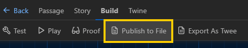
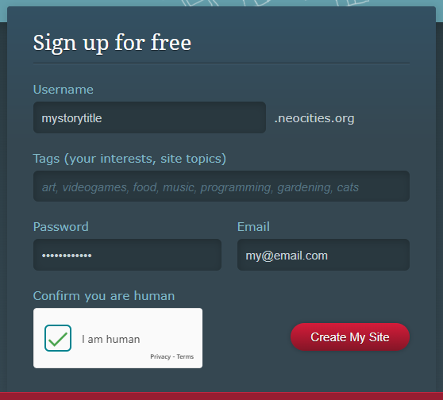
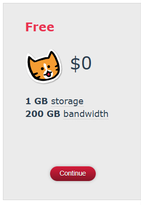
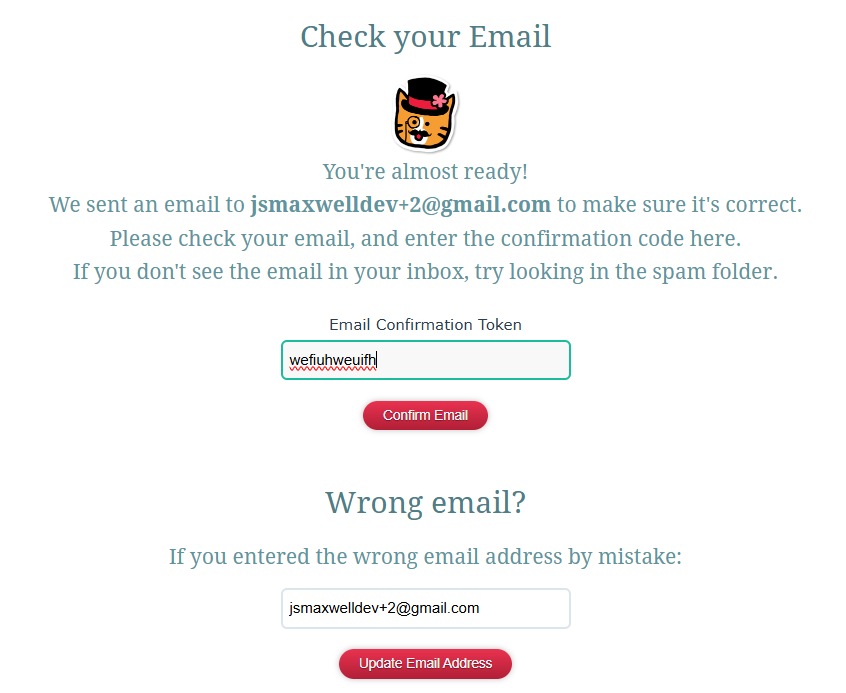
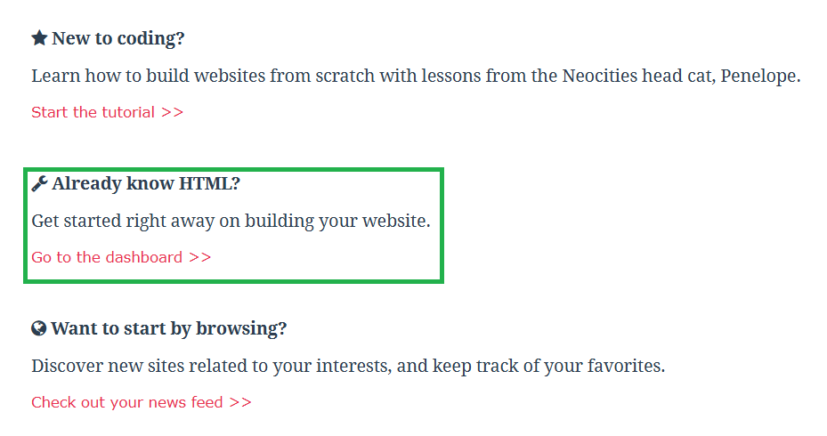
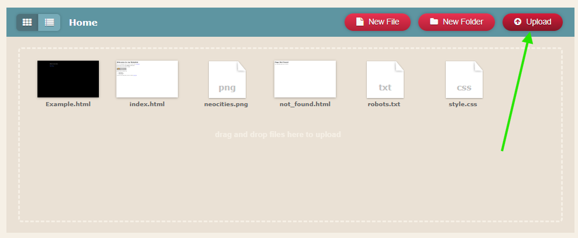
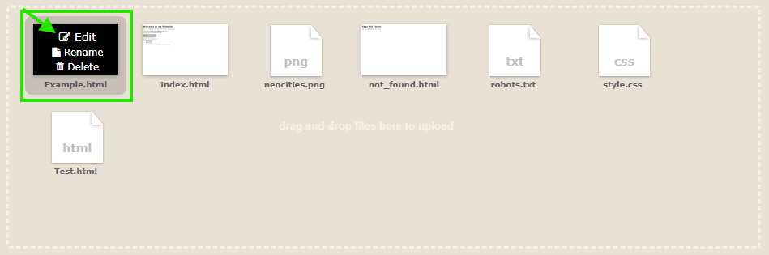
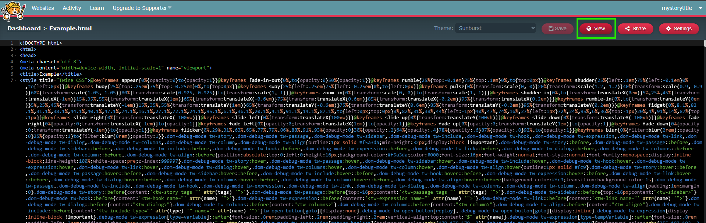

# Sharing Stories
One of the best parts of creating stories is sharing them with others! Unfortunately, sharing stories is a little complicated with Twine, but it is still possible. When you want to share, follow these steps:

## Downloading the Story
First, download the story from Twine.

1. In Twine, select the "Build" option from the top menu
1. Select the "Publish to File" option  
	
1. Choose a folder for the download, and click "Save"  
	- Make sure you can find it later!

Now you have your full story in one HTML file.

## Creating a Neocities Website
Next, you will need a place to host your story. This is possible with Neocities. **Note: you must be able to verify your email in order to host on Neocities.**

1. Go to [neocities.org](https://neocities.org/)
1. Fill out your information on the sign-up form  
    
1. Click the "Create My Site" button
1. On the next page, in the "Free" section, click the "Continue" button  
    
1. On the next page, do as it says
    - Check your email for the Confirmation Token
1. When you have the token, enter it in the box  
    - 
1. Click the "Confirm Email" button

That's it! You now have your own Neocities site where you can host whatever you would like.

## Adding the Story to your Neocities Page
Next, it's time to add your story to your Neocities site.

1. Click the "Go to the dashboard >>" link  
    
1. On the dashboard, click the "Upload" button  
    
1. Locate your downloaded story HTML file
1. Click "Open"
1. Hover over the newly uploaded file, and click "Edit"  
    
1. In the top right, click the "View" button  
    

That's it! You are now viewing your published story. The URL in the address bar of your browser can be shared anywhere online!

## Sharing
Once you have your URL, share it using the link on the [homepage](../BOOKREADME.md)!
