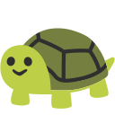
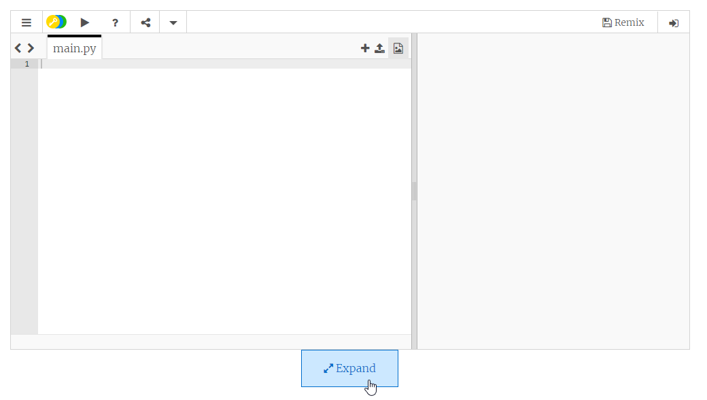

# Turtle Code-Along
In this introductory activity, use [turtle graphics](https://en.wikipedia.org/wiki/Turtle_graphics) to create a drawing in Python!



## What is Python?
[Python](https://www.python.org/) is a popular multi-purpose programming language used by professional and hobbyist developers alike. You can use it to develop games, build websites, control robots, and more!

## Getting Started
**Trinket** is a free online tool that lets you write and run Python code right from a web browser!

1. [Click here to go to the Starter Trinket](https://trinket.io/turtle/6111fa23b0?runOption=run)
1. Click the "Expand" button at the bottom to make it fit a little better if desired  
    
1. In the **main.py** file on the left, add the following line to _import_ everything from the **turtle** library:
    ```py
    from turtle import *
    ```
1. Click the Play button, and notice that nothing happens yet
1. Make a new line under the `import`, and add the following code:
    ```py
    shelly = Turtle()
    ```
1. `shelly` is now a `Turtle` object - but Shelly needs a shape! Under that line, add the following code to give Shelly a shape:  
    ```py
    shelly.shape("arrow")
    ```
1. Run the code again to see Shelly appear on the screen!
1. **BONUS:** Update the code so that instead of an "arrow" shape, the turtle looks like a turtle

The setup code should look something like this:

```py
from turtle import *

shelly = Turtle()
shelly.shape("arrow")
```

## Adding Color
Make things a little more interesting by updating the colors.

1. Make a new line, and add code to change Shelly's color
    - HINT: this is a lot like how the `shape` was updated - just using `color` instead
1. On the next line, add the following code:
    ```py
    paper = shelly.getscreen()
    ```
1. Now, the `paper` variable stores the screen. Change its color using `bgcolor`
1. **BONUS:** Play around with the settings to create a pleasing (or terrible) color scheme!

The code for the color should look something like this:

```py
shelly.color("green")
paper = shelly.getscreen()
paper.bgcolor("gold")
```

## Moving the Turtle
One of the most useful turtle abilities is the ability to move across the screen and draw like a pen! Create a blank line, and then add the following command on the next line:

```python
shelly.forward(100)
```

Click the Run button to see the turtle move across the screen! Specifically, it moves **forward** `100` pixels in the direction it is currently facing (90 degrees).

It is also possible to turn the turtle. Add the following command on the next line:

```python
shelly.right(90)
```

This command turns the turtle `90` degrees to the **right**. Previously the direction of the turtle was 90 degrees (pointing to the right), so after turning 90 degrees to the right, the turtle should face down (180 degrees).

Run the program again to see the turtle move to the right, then turn to face down!

### Drawing a Square
Add the following commands to the file, under the existing commands:

```python
shelly.forward(100)
shelly.right(90)
shelly.forward(100)
shelly.right(90)
```

Run the program to see what this code does. It should draw part of a square! How does that work? On a piece of paper, or on a whiteboard, try to draw the same square as the turtle:

1. Draw the top side from left to right
1. Turn the writing utensil and draw the right side from top to bottom
1. Turn the writing utensil and draw the bottom side from left to right

So, the turtle moves `100` pixels to the right, turns `90` degrees to face down, moves `100` pixels down, turns `90` degrees to face left, moves `100` pixels to the left, and then turns `90` degrees to face up!

### The Rest of the Square
Complete the square that Shelly is drawing. The code will be the same as the first part of the square:

```python
shelly.forward(100)
shelly.right(90)
```

## Looping
At this point, there appears to be a lot of repeated lines of code. This isn't too big of a deal, but it could be annoying to change the size of the square, or draw a shape with more sides. Luckily, there is a way to automatically repeat commands: the `for` loop!

### Looping the Square
Use a `for` loop to repeat the code that draws the square.

1. Identify the two lines of square-drawing code that repeat
    - `shelly.forward` and `shelly.right`
1. Notice how many times those two lines repeat: **4**
1. Remove all repeated instances of that code, so there are only two commands remaining
1. _Indent_ the two lines by adding a couple spaces in front of them
1. Above the two lines, _not_ indented, add a `for` loop
    - It should start with `for`
    - Then, add `x in`
    - Then add `range(4):`
    - Note that it should repeat `4` times

The code should look something like this:

```python
for x in range(4):
  shelly.forward(100)
  shelly.right(90)
```

Much shorter, and easier to maintain! Now, to change the size of the square, only one number has to be updated.

## Drawing a Star
Another cool thing about `for` loops is they can repeat any number of times. Three or four times isn't that cool, but repeating **60** times can be very helpful! Use a `for` loop to draw another type of shape - a star.

### Preparation
First, get to the proper location on the map (without drawing), and change the speed and color as well.

1. At the bottom of the file, make a new line
1. Add a command for Shelly to pick up the pen: `shelly.penup()`
1. Under that, add a command for Shelly to go to a new location: `shelly.goto(-300, 50)`
1. Under that, have Shelly put the pen back down: `shelly.pendown()`
1. Next, add a command to change Shelly's speed: `shelly.speed(20)`
1. Finally, change Shelly's color to make this shape special: `shelly.color("purple")`

The code for this part should look like this:

```python
shelly.penup()
shelly.goto(-300, 50)
shelly.pendown()
shelly.speed(20)
shelly.color("purple")
```

### For Loop
Now that Shelly is in position, create a new `for` loop that draws a star shape.

1. Make a new line at the bottom of the file
1. Create a `for` loop structure to repeat **60** times
    - Start with `for`
    - Then add `x in`
    - Finally, add `range(60):`
1. Under the `for` line, create a new _indented_ line (add a couple spaces in front)
1. On the new indented line, move Shelly **forward** - **200** pixels
1. Under that, still indented, turn Shelly to the **right** - **186** pixels

The code should look something like this:

```py
for x in range(60):
  shelly.forward(200)
  shelly.right(186)
```

Feel free to update the numbers to see how the star changes!

### Hiding the Turtle
At the end, hide the turtle so that the star can be viewed with nothing in the way!

```py
shelly.hideturtle()
```

## Final Code
At the end of the code-along, the code should look something like this:

```python
from turtle import *

shelly = Turtle()
shelly.shape("turtle")

shelly.color("green")

paper = shelly.getscreen()
paper.bgcolor("gold")

for x in range(4):
  shelly.forward(100)
  shelly.right(90)

shelly.penup()
shelly.goto(-300, 50)
shelly.pendown()
shelly.speed(20)
shelly.color("purple")

for x in range(60):
  shelly.forward(200)
  shelly.right(186)

shelly.hideturtle()
```

## Next Steps
After completing the code-along, take a look at the [examples](TurtleExamples.md) or try out some [challenges](TurtleChallenges.md)!
